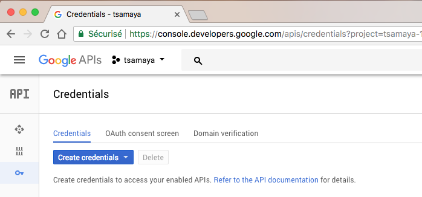
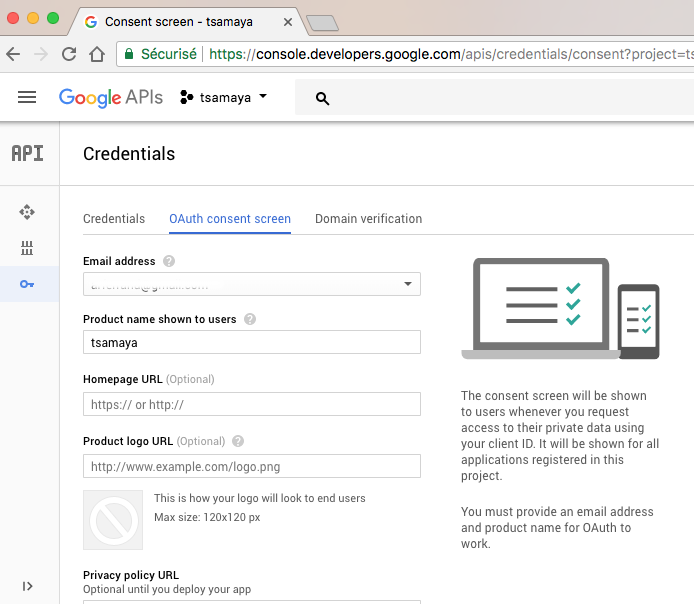
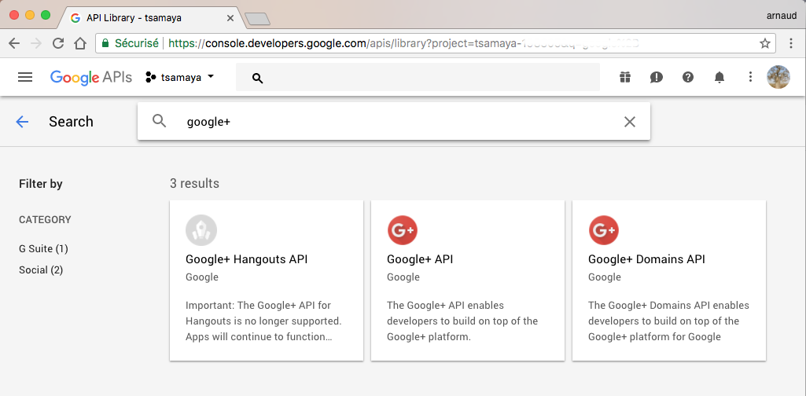
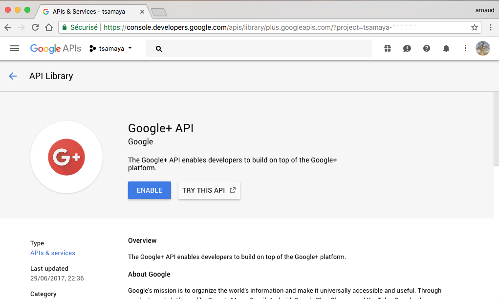
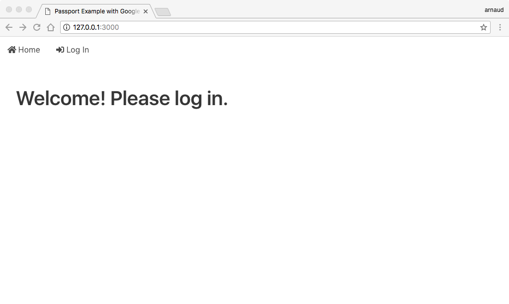
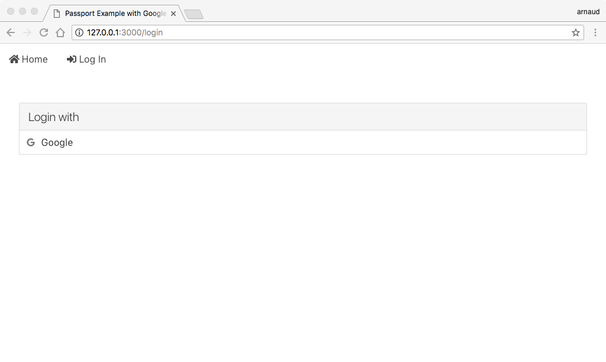
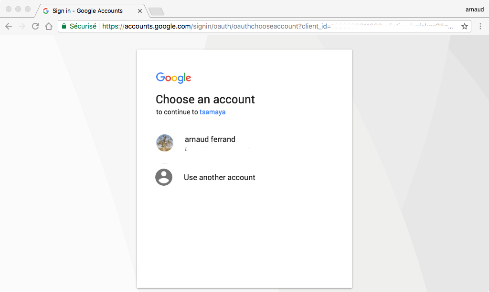
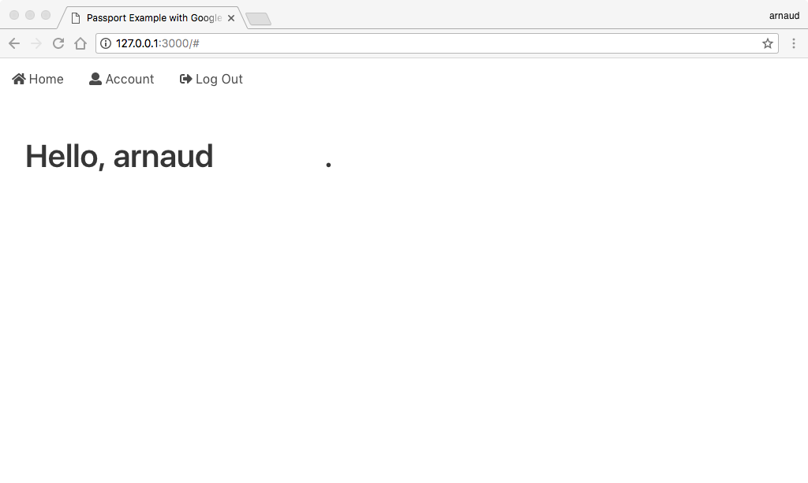
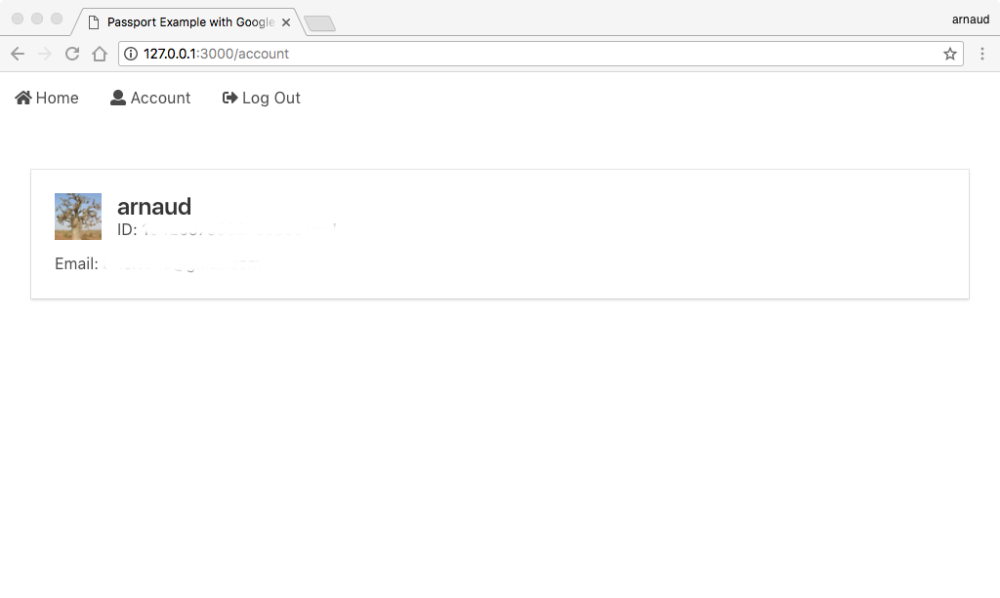

# passport-example-with-google-oauth2

This repository is a [Passport](http://www.passportjs.org/) example using an [Express](http://expressjs.com/) application with an authentication using Google-OAuth2 authorization.

## Usage

#### Create an OAuth 2.0 client ID

First, create a project at [console.developers.google.com](https://console.developers.google.com)

*Create authorization credentials*

1. Open the [Credentials page](https://console.developers.google.com/apis/credentials) in the API Console.

  

2. Fill the form for in the _Oauth consent screen_ tab, only the *Product name shown to users* is mandatory

  

3. Back in _Credentials_ tab,  Click *Create credentials > OAuth client ID*.

4. Complete the form. Set the application type to Web application. Fill the *Authorized redirect URIs*, here with our local server use `http://127.0.0.1:3000/auth/google/callback`.

5. click *Create*

*Enable Google+ Library*

1. Open the [Library page](https://console.developers.google.com/apis/library) in the API console.

2. Search for *Google+ API*



3. Enable this API




#### Configure Strategy

create a `.env` file with:
```
CLIENT_ID=YOUR-CLIENT-ID
CLIENT_SECRET=YOUR-CLIENT-SECRET
```

#### Install dependencies

```sh
$ npm install
```

or

```sh
$ yarn
```

#### Run

```sh
$ npm start
```

or

```sh
$ yarn start
```

open your browser on [localhost:3000](http://localhost:3000)



<!-- use the menu login link



Log with Google



Logged in



Check your profile

 -->

## Resources

- Passport [Facebook example](https://github.com/passport/express-4.x-facebook-example) from [@jaredhanson](https://github.com/jaredhanson)
- [Bulma](https://bulma.io/) CSS framework based on Flexbox, from [@jgthms](https://github.com/jgthms)

## Contributing
Anyone and everyone is very welcome to contribute.

## Issues
Find a bug or want to request a new feature? Please let me know by submitting an issue.

## Licensing
Licensed under the MIT License

A copy of the license is available in the repository's [LICENSE](LICENSE) file.
